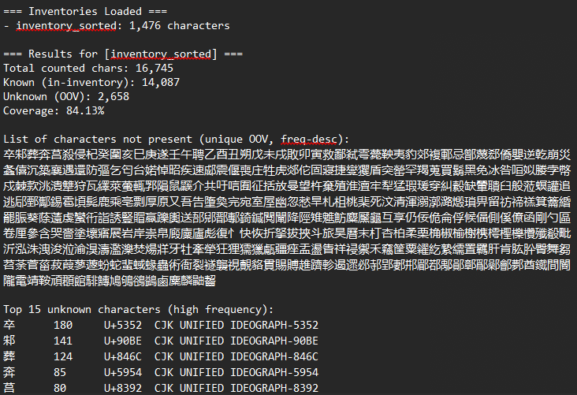

# Han Character Coverage Checker using 三百千 (SanBaiQian) as a Lexeme Inventory

# Details
This is a program that evaluates a Chinese text for comprehensibility within a vocabulary inventory of strictly those from 三百千 ("SanBaiQian", comprising 三字经 Three Character Classic，百家姓 Hundred Family Surnames，and 千字经 Thousand Character Classic). The hope is that this can aid an individual learning Literary Chinese this way with finding texts of comprehensible input.

In total, the canonical SanBaiQian contains 1,476 unique characters, many of which are of extremely high usage. Each text is extremely old:
- The Three Character Classic 三字经 was made during the Song dynasty in the 13th Century, allegedly by either Wang Yinglin 王應麟 or Ou Shizi 區適子.
- The Hundred Family Surnames 百家姓 was made during the Song dynasty.
- The Thousand Character Classic 千字经 is purported to have been made around the 6th Century.

The Three and Thousand Character Classics are impressive works of constrained writing; the former being strictly in 3-character clauses, and the latter using 1,000 unique characters with no recurrence. Naturally, this means the Thousand Character Classic is the largest source of them.

There is support for Traditional and Simplified Chinese, and in case of a mixed script (usu. if it has 于 and 於), you can use both, though this feature isn't great and could be better. 

Technically, the inventories in this program can be modified simply through modifying what is within the files. Therefore, I encourage users to do this! Add characters you know and don't know to this program.

When used, the program will output:
1) Stats of comprehensibility (Han-character coverage)
2) List of characters not present (unique OOV list)
3) Frequency lists for OOV characters: top-N and bottom-N (default 15)

Example image uses the original Chunqiu 春秋 purportedly written by Confucius.

Optional extras:
- Coverage per inventory (when multiple inventories are provided)
- UNION coverage across inventories (treat any inventory hit as known)
- Per-line coverage breakdown

## Usage
This program is usable from CLI, the Python Shell, or via a `run_coverage_wizard.py`. 

Ways to use:
- `run_coverage_wizard.py`
- Import in Python shell/Jupyter and call `analyze_text(...)` + `render_text_report(...)`
- Traditional CLI

Examples (CLI):
    python han_coverage.py -i inventory_sorted.txt --input my_text.txt
    python han_coverage.py -i inventory_sorted.txt inventory_simplified.txt --union --input my_text.txt

If --input is omitted, the script reads from STDIN.

# Acknowledgements
Artificial Intelligence (AI) was used to assist the creation of this program.

# Licence
As a supporter of the [Free Software Movement](https://www.fsf.org/about/) and its values, this is published under a [GNU Licence](https://www.gnu.org/licenses/gpl-3.0.en.html). 

# References
- Sturgeon, D. (2006) ‘中國哲學書電子化計劃 [Chinese Text Project]’. Boston, MA. Available at: https://ctext.org/ (Accessed: 7 July 2025).
- Sturgeon, D. (2020) ‘Digitizing Premodern Text with the Chinese Text Project’, Journal of Chinese History, 4(2), pp. 486–498. Available at: https://doi.org/10.1017/jch.2020.19.
- Sturgeon, D. (2021) ‘Chinese Text Project: A dynamic digital library of premodern Chinese’, Digital Scholarship in the Humanities, 36(Supplement_1), pp. i101–i112. Available at: https://doi.org/10.1093/llc/fqz046.
- The Unicode Consortium (2025) ‘CJK Unified Ideographs’, in The Unicode Standard, Version 17.0. 17.0.0. South San Francisco: Unicode, Inc., pp. 553–1086.

