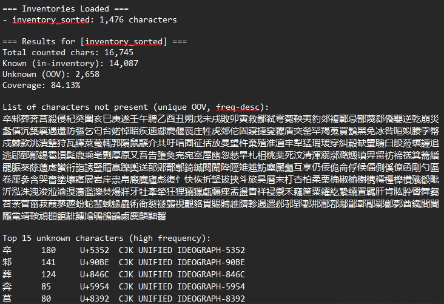

# 汉字覆盖度检查器（使用《三百千》作为词汇清单）

# 详情
本程序用于评估中文文本在严格限定于《三百千》（包括《三字经》、《百家姓》和《千字文》）词汇范围内的可理解性。希望这能帮助以这种方式学习文言文的学习者找到可理解输入文本。

标准《三百千》总共包含 1,476 个独特汉字，其中许多使用频率极高。每部文献都非常古老：
- 《三字经》创作于 13 世纪的宋朝，据传作者为王应麟或区适子。
- 《百家姓》成书于宋朝。
- 《千字文》据称创作于约公元 6 世纪。

《三字经》和《千字文》是受限写作的杰出代表：前者严格采用三字句，后者使用一千个不重复的汉字。自然，这意味着《千字文》是其中最大的字源。

程序支持繁体和简体中文。对于混合文本（通常包含“于”和“於”等情况），可以同时使用两种字体，不过此功能尚不完善，有待改进。

从技术上讲，本程序中的字表只需修改相应文件即可调整。因此，鼓励用户这样做！请将您认识或不认识的汉字添加到程序中。

使用时，程序将输出：
1)  可理解性统计（汉字覆盖度）
2)  未出现字符列表（唯一未登录词列表）
3)  未登录词的频率列表：前 N 个和后 N 个（默认 15 个）

示例图片使用了据称是孔子所著的《春秋》。

可选功能：
- 每个字表的覆盖度（当提供多个字表时）
- 跨字表的并集覆盖度（任一字表中出现即视为已知）
- 逐行覆盖度细分

## 使用方法
本程序可通过 CLI、Python Shell 或 `run_coverage_wizard.py` 使用。

使用方式：
- `run_coverage_wizard.py`
- 在 Python shell/Jupyter 中导入并调用 `analyze_text(...)` 和 `render_text_report(...)`
- 传统 CLI

示例（CLI）：
    python han_coverage.py -i inventory_sorted.txt --input my_text.txt
    python han_coverage.py -i inventory_sorted.txt inventory_simplified.txt --union --input my_text.txt

如果省略 --input，脚本将从 STDIN 读取。

# 致谢
本程序的创作得到了人工智能 (AI) 的辅助。

# 许可证
作为[自由软件运动](https://www.fsf.org/about/)及其价值观的支持者，本项目采用[GNU 许可证](https://www.gnu.org/licenses/gpl-3.0.en.html)发布。

# 参考文献
- Sturgeon, D. (2006) ‘中國哲學書電子化計劃 [Chinese Text Project]’. Boston, MA. 网址: https://ctext.org/ (访问于: 2025年7月7日).
- Sturgeon, D. (2020) ‘Digitizing Premodern Text with the Chinese Text Project’, Journal of Chinese History, 4(2), pp. 486–498. 网址: https://doi.org/10.1017/jch.2020.19.
- Sturgeon, D. (2021) ‘Chinese Text Project: A dynamic digital library of premodern Chinese’, Digital Scholarship in the Humanities, 36(Supplement_1), pp. i101–i112. 网址: https://doi.org/10.1093/llc/fqz046.
- The Unicode Consortium (2025) ‘CJK Unified Ideographs’, in The Unicode Standard, Version 17.0. 17.0.0. South San Francisco: Unicode, Inc., pp. 553–1086.